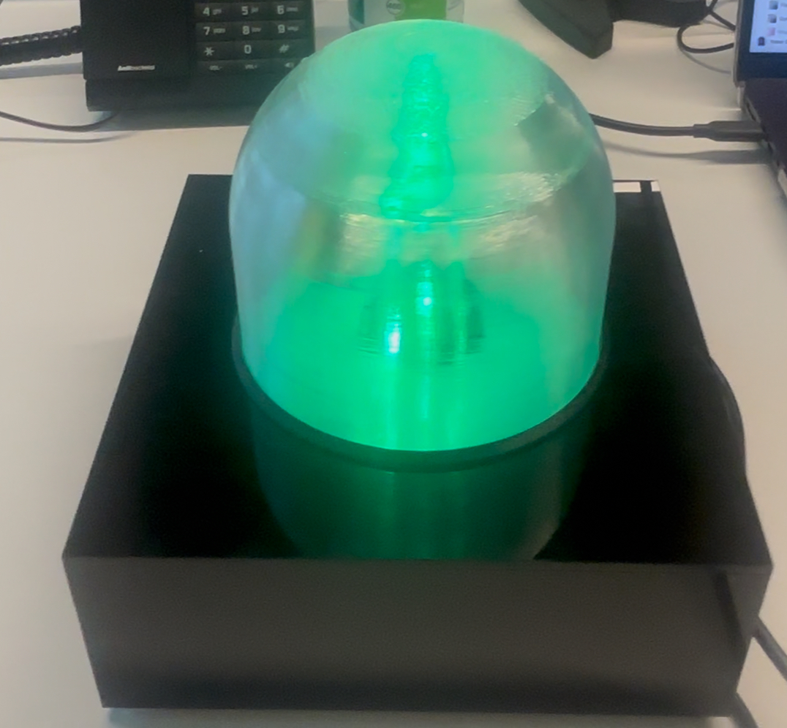

# DJ Sound Classifier — CASA0018

<div align="center">

**Author:** yussr19  
**GitHub:** [casa0018-DJ-Classifier](https://github.com/yussr19/casa0018-DJ-Classifier)  
**Edge Impulse Project:** [Public Project Link](https://studio.edgeimpulse.com/public/965867/live)

<br>



*Custom 3D-printed enclosure showing a control noise (green) classification*

</div>

---

# Overview

The **DJ Sound Classifier** is a real-time embedded audio classification system that detects acoustic events in DJ sets and triggers reactive LED lighting effects entirely on-device — no cloud connection required.

The system classifies three audio events:

| Class | LED Response |
|---|---|
| **Bass drop** | 🔵 Blue chasing effect |
| **Kick drop** | 🔴 Solid red |
| **Control noise** | 🟢 Solid green |

---

# Motivation

The UK's grassroots music venue scene has faced a prolonged financial crisis, with over 125 venues closing in 2023 alone due to rising operational costs, including professional lighting and production systems.

This project explores whether **edge machine learning** can provide a low-cost alternative to commercial audio-reactive lighting systems for resource-constrained venues.

---

# Hardware

| Component | Details | Approx. Cost |
|---|---|---|
| Arduino Nano 33 BLE Sense | Microcontroller with onboard microphone | £35 |
| WS2812B NeoPixel Strip (16 LEDs) | Addressable RGB LEDs | £5 |
| 3×AA Battery Pack | 4.5V power supply | £2 |
| 330Ω Resistor | Data-line protection | <£1 |
| 100µF Capacitor | Power smoothing | <£1 |
| Breadboard + Jumper Wires | Circuit assembly | £3 |
| 3D Printed Enclosure | `DOME.stl` + `light_boxx.stl` | ~£2 |

**Estimated total cost:** ~£48

---

# Reproducing the Project

## Step 1 — Print the Enclosure

Print both STL files from the `/enclosure` folder:

- `light_boxx.stl` — base housing for the Arduino and breadboard
- `DOME.stl` — light-diffusing dome cover

### Recommended Settings

- PLA
- 0.2mm layer height
- 20% infill

For best diffusion, print the dome using **white or translucent filament**.

---

# Step 2 — Assemble the Circuit

## Wiring Diagram

```text
Battery (+) ─────────────────────────────── LED Strip 5V
Battery (-) ─────────────────────────────── LED Strip GND
Battery (-) ─────────────────────────────── Arduino GND

Capacitor (+) ───────────────────────────── LED Strip 5V
Capacitor (-) ───────────────────────────── LED Strip GND

Arduino D6 ─── 330Ω resistor ───────────── LED Strip DIN
```

### Important Notes

- The **330Ω resistor** protects the first LED from voltage spikes.
- The **100µF capacitor** stabilises the power rail and prevents brownouts or Arduino resets.
- All components must share a **common ground**.

Place the Arduino and breadboard inside `light_boxx.stl`, then wrap the LED strip around the inside of the dome.

---

# Step 3 — Set Up Edge Impulse

You can either use the pretrained model or retrain the system from scratch.

---

## Option A — Use the Existing Model (Recommended)

1. Open the public Edge Impulse project:  
   https://studio.edgeimpulse.com/public/965867/live

2. Click **Clone this project**

3. Navigate to:

```text
Deployment → Arduino Library → Build
```

4. Download the generated ZIP library.

---

## Option B — Retrain the Model

### Install Edge Impulse CLI

```bash
npm install -g edge-impulse-cli
edge-impulse-daemon --clean
```

### Collect Data

Record:
- 2-second samples
- 16kHz mono WAV
- ~115 samples per class

### Classes

| Class | Description |
|---|---|
| `bass_drop` | Sustained bass-heavy sections |
| `kick_drop` | Rhythmic kick drum patterns |
| `control_noise` | Ambient crowd/room noise |

---

## Create the Impulse

### Input Parameters

- Window size: 2000ms
- Window increase: 500ms
- Frequency: 16000Hz

### Processing Block

```text
Audio (MFE)
```

### Learning Block

```text
Classification
```

---

## MFE Parameters

| Parameter | Value |
|---|---|
| Frame length | 0.02 |
| Frame stride | 0.01 |
| Filters | 6 |
| FFT length | 256 |
| Low frequency | 0 |
| High frequency | 300 |

---

## Training Settings

| Parameter | Value |
|---|---|
| Epochs | 100 |
| Learning rate | 0.005 |
| Batch size | 32 |
| Data augmentation | Off |

### Keras Expert Mode

Update the reshape layer:

```python
Reshape((int(input_length / 6), 6))
```

---

# Step 4 — Install Arduino Libraries

## Install NeoPixel Library

Arduino IDE:

```text
Tools → Manage Libraries → Adafruit NeoPixel → Install
```

## Install Edge Impulse Library

```text
Sketch → Include Library → Add .ZIP Library
```

Select the ZIP downloaded from Edge Impulse.

---

# Step 5 — Upload the Arduino Sketch

1. Open:

```text
DJ_LED2/DJ_LED2.ino
```

2. Select board:

```text
Arduino Nano 33 BLE Sense
```

3. Select the correct port and click **Upload**

---

## Optional: Upload via bossac

```bash
ls /dev/cu.usbmodem*

bossac -p /dev/cu.usbmodem[PORT] -e -w -v -R DJ_LED2.ino.bin
```

---

# Step 6 — Power and Test

1. Disconnect USB
2. Connect the 3×AA battery pack
3. The LEDs flash white on startup to confirm the system is active

## Test Responses

| Audio Event | LED Behaviour |
|---|---|
| Bass-heavy music | 🔵 Blue chasing |
| Kick-heavy patterns | 🔴 Solid red |
| Ambient noise / silence | 🟢 Solid green |

> Best performance occurs when positioned approximately 30–50cm from the speaker.

---

# ML Model Details

| Feature | Value |
|---|---|
| Platform | Edge Impulse |
| Project ID | 965867 |
| Preprocessing | MFE, 300Hz LPF |
| Filters | 6 |
| FFT Length | 256 |
| Architecture | 1D CNN |
| Deployment | INT8 quantised (EON Compiler) |
| RAM Usage | 13.8KB |
| Flash Usage | 46.5KB |
| Inference Time | ~5ms |

---

# Dataset

| Class | Samples |
|---|---|
| bass_drop | 116 |
| kick_drop | 115 |
| control_noise | 115 |
| **Total** | **346** |

### Dataset Split

- 80% training
- 20% testing

---

# Results Summary

| Experiment | Accuracy | Weighted F1 |
|---|---|---|
| Broadband Spectrogram | 30.0% | 0.14 |
| MFE 200Hz | 52.9% | 0.51 |
| **MFE 300Hz (Best)** | **57.1%** | **0.58** |
| MFE 500Hz | 57.1% | 0.57 |
| MFCC Broadband | 52.9% | 0.53 |
| MFCC 300Hz | 44.3% | 0.42 |
| Venue Test 1 | 21.74% | 0.37 |
| Venue Test 2 | 35.71% | 0.46 |

---

# Known Limitations

- Significant domain gap between home and live venue recordings
- Kick drops overlap spectrally with bass drops below 300Hz
- Environmental acoustics reduce reliability in crowded venues
- Direct mixer line-in would substantially improve performance

---


